# Skaffold Testing Integration

**Last Updated**: October 4, 2025  
**Status**: ✅ COMPLETE - Fully integrated automated testing

This document explains how the Simple Kanban Board project integrates automated testing with Skaffold deployment workflows.

## Overview

Skaffold automatically runs our comprehensive test battery after each deployment, ensuring that every deploy is validated before being considered successful. The system now includes complete testing for authentication, group collaboration, API functionality, admin features, and security validation.

## ✅ **Current Implementation Status**

- **✅ Post-Deploy Hooks**: Fully implemented and working
- **✅ Environment-Specific Testing**: Dev (soft-fail) vs Prod (hard-fail)
- **✅ Comprehensive Test Coverage**: All major features validated
- **✅ Group Collaboration Testing**: Complete team management validation
- **✅ Machine-Readable Reports**: JSON output for CI/CD integration
- **✅ Multi-Mode Testing**: Quick, full, and verbose modes

## Integration Methods

### 1. Post-Deploy Hooks (Current Implementation)

The `skaffold.yaml` includes post-deploy hooks that automatically run tests:

```yaml
deploy:
  helm:
    releases:
    - name: simple-kanban-dev
      chartPath: helm/simple-kanban
      namespace: apps-dev
      valuesFiles:
      - helm/simple-kanban/values-dev.yaml
      hooks:
        after:
        - host:
            command: ["./scripts/post-deploy-test.sh", "dev", "quick"]
            dir: "."
```

### 2. Environment-Specific Testing

Different environments use different failure modes:

- **Dev Environment**: Full tests with **soft failure** (report-only)
- **Prod Environment**: Full tests with **hard failure** (blocks deployment)

## Test Execution Flow

```mermaid
graph TD
    A[skaffold run] --> B[Build Image]
    B --> C[Deploy to Kubernetes]
    C --> D[Wait for Deployment Ready]
    D --> E[Run Post-Deploy Hook]
    E --> F[Execute Test Battery]
    F --> G{Tests Pass?}
    G -->|Yes| H[✅ Deployment Success]
    G -->|No| I[❌ Deployment Failed]
    I --> J[Show Logs & Exit]
```



## Scripts

### `scripts/post-deploy-test.sh`
- Waits for deployment to be ready
- Runs appropriate test suite based on environment
- Provides detailed logging and error reporting
- Exits with proper codes for CI/CD integration

### `scripts/test-all.sh`
- Comprehensive test battery
- Supports multiple modes (quick, full, verbose)
- Generates machine-readable reports
- Validates all application functionality

## Usage Examples

### Development Deployment with Testing
```bash
# Deploy to dev with quick tests
skaffold run -p dev

# Deploy to dev with full tests
skaffold run -p dev --post-deploy-hook="./scripts/post-deploy-test.sh dev full"
```

### Production Deployment with Testing
```bash
# Deploy to prod with comprehensive tests
skaffold run -p prod
```

### Manual Test Execution
```bash
# Run tests independently
./scripts/test-all.sh --quick
./scripts/test-all.sh --verbose
./scripts/post-deploy-test.sh dev quick
```

## Test Results

### Console Output
Post-deploy hooks provide real-time feedback:
```
[POST-DEPLOY] Starting post-deploy validation for environment: dev
[POST-DEPLOY] Test mode: quick
[POST-DEPLOY] Waiting for deployment to be ready...
[POST-DEPLOY] Deployment is ready
[POST-DEPLOY] Running test battery in quick mode...
[POST-DEPLOY] All tests passed! Deployment validation successful.
```

### Machine-Readable Reports
Test results are saved to `test-results.json`:
```json
{
  "timestamp": "2025-10-04T10:37:25-07:00",
  "duration": 13,
  "mode": "quick",
  "summary": {
    "total": 7,
    "passed": 7,
    "failed": 0,
    "skipped": 1
  },
  "success": true
}
```

## Benefits

### 1. **Automated Validation**
- Every deployment is automatically tested
- No manual intervention required
- Consistent validation across environments

### 2. **Fast Feedback**
- Quick tests complete in ~15 seconds
- Immediate notification of deployment issues
- Early detection of regressions

### 3. **Environment-Appropriate Testing**
- Dev: Quick smoke tests for rapid iteration
- Prod: Comprehensive validation for reliability

### 4. **CI/CD Integration**
- Proper exit codes for automation
- Machine-readable reports for dashboards
- Integration with notification systems

## Configuration Options

### Skaffold Hook Types
```yaml
hooks:
  before:  # Run before deployment
  after:   # Run after deployment (current)
  
  # Host vs Container execution
  - host:      # Run on local machine (current)
      command: ["./scripts/test.sh"]
  - container: # Run in Kubernetes pod
      image: test-runner
      command: ["test"]
```

### Test Modes
- `quick`: Fast smoke tests (~15s)
- `full`: Comprehensive validation (~45s)
- `verbose`: Detailed output for debugging

### Environment Variables
```bash
# Override default behavior
SKIP_TESTS=true skaffold run -p dev
TEST_MODE=full skaffold run -p dev
```

## Troubleshooting

### Common Issues

**Tests Fail After Deployment**
```bash
# Check deployment status
kubectl get deployment simple-kanban-dev -n apps-dev

# View application logs
kubectl logs -n apps-dev deployment/simple-kanban-dev --tail=50

# Run tests manually for debugging
./scripts/test-all.sh --verbose
```

**Hook Script Not Found**
```bash
# Ensure scripts are executable
chmod +x scripts/*.sh

# Verify script paths in skaffold.yaml
```

**Timeout Issues**
```bash
# Increase wait time in post-deploy-test.sh
# Default: 300s (5 minutes)
kubectl wait --for=condition=available --timeout=600s deployment/...
```

## Future Enhancements

### Potential Additions
- **Performance testing** integration
- **Security scanning** post-deploy
- **Database migration** validation
- **Load testing** for production
- **Rollback automation** on test failure

### Notification Integration
```bash
# Add to post-deploy-test.sh
curl -X POST "https://hooks.slack.com/..." \
  -d "{\"text\":\"✅ $DEPLOYMENT_NAME deployed and tested successfully\"}"
```

This integration ensures that your Simple Kanban Board deployments are always validated and reliable! 🚀
